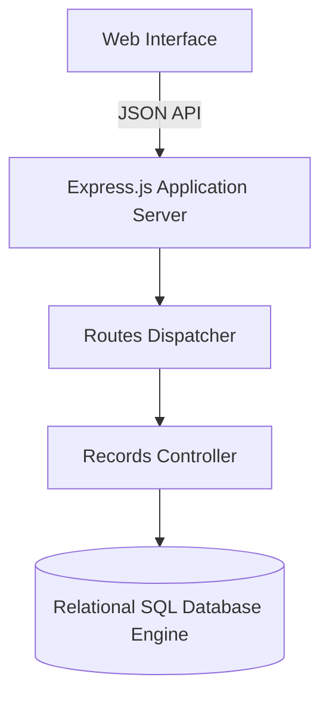

# SQL Records Shelf: Fullstack Database Record Workspace

Modular fullstack CRUD application featuring an Express.js backend, relational SQL schema persistence, input validation, and an interactive record dashboard.



## System Architecture

- **`schema.sql`**: Relational database table definitions, indexing strategies, and constraint declarations.
- **`backend/`**: Modular Node.js / Express server organized with controllers, routing middleware, and database adapters.
- **`frontend/`**: Responsive client interface for inspecting, filtering, adding, and modifying catalog records.

## Technology Stack

- **Backend**: Node.js, Express.js
- **Database**: SQL (PostgreSQL / SQLite compatible)
- **Frontend**: HTML5, CSS3, JavaScript

## Getting Started

```bash
# Backend setup
cd backend
npm install
npm start
```
